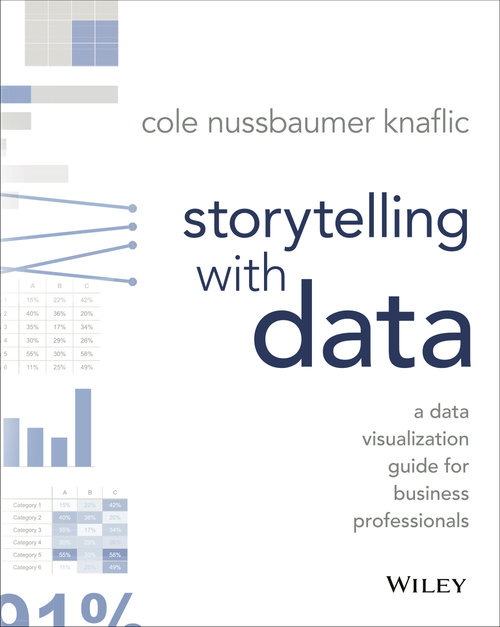
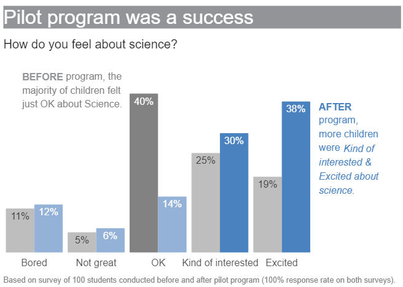
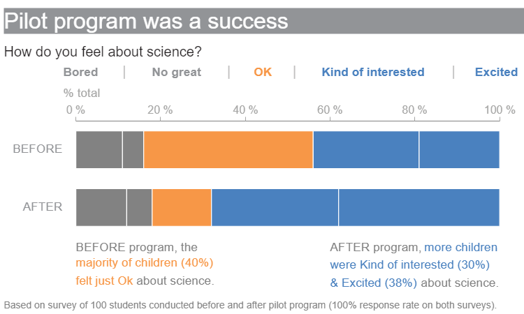
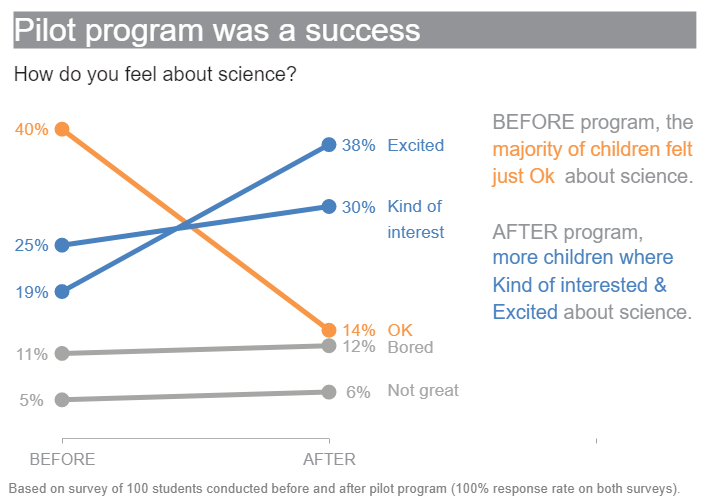
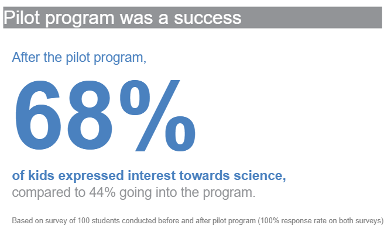

# Story telling with data (Python + Bokeh)

Recreation of Cole Nussbaumer Knaflic's Storytelling with Data (Wiley, 2015) plots using Python and Bokeh.

Original data provided by the book's author. Located [here](http://www.storytellingwithdata.com/book/downloads).

# About this book

|||
|---|---|
|| |
|||

**Storytelling with data** teaches you the fundamentals of data visualization and how to communicate effectively with data. You'll discover the power of storytelling and the way to make data a pivotal point in your story.

# Examples

|||
|---|---|
|Example 1|Example2|
|| |
|Example 3|Example4|
|| |
|||

# Plots

## Chapter 2
* [FIG0207](https://raw.githubusercontent.com/adamribaudo/storytelling-with-data-ggplot/master/plot%20output/FIG0203.png) / [Code](FIG0203.R)

## Chapter 4
* [FIG0409](https://raw.githubusercontent.com/adamribaudo/storytelling-with-data-ggplot/master/plot%20output/FIG0203.png) / [Code](FIG0203.R)

## Chapter 5
* [FIG0506](https://raw.githubusercontent.com/adamribaudo/storytelling-with-data-ggplot/master/plot%20output/FIG0203.png) / [Code](FIG0203.R)

* [FIG0510](https://raw.githubusercontent.com/adamribaudo/storytelling-with-data-ggplot/master/plot%20output/FIG0203.png) / [Code](FIG0203.R)

* [FIG0513](https://raw.githubusercontent.com/adamribaudo/storytelling-with-data-ggplot/master/plot%20output/FIG0203.png) / [Code](FIG0203.R)

## Chapter 6
* [FIG0601](https://raw.githubusercontent.com/adamribaudo/storytelling-with-data-ggplot/master/plot%20output/FIG0203.png) / [Code](FIG0203.R)

* [FIG0602](https://raw.githubusercontent.com/adamribaudo/storytelling-with-data-ggplot/master/plot%20output/FIG0203.png) / [Code](FIG0203.R)

* [FIG0603](https://raw.githubusercontent.com/adamribaudo/storytelling-with-data-ggplot/master/plot%20output/FIG0203.png) / [Code](FIG0203.R)

* [FIG0604](https://raw.githubusercontent.com/adamribaudo/storytelling-with-data-ggplot/master/plot%20output/FIG0203.png) / [Code](FIG0203.R)

## Chapter 8
* [FIG0819](https://raw.githubusercontent.com/adamribaudo/storytelling-with-data-ggplot/master/plot%20output/FIG0203.png) / [Code](FIG0203.R)

## Chapter 9
* [FIG0923](https://raw.githubusercontent.com/adamribaudo/storytelling-with-data-ggplot/master/plot%20output/FIG0203.png) / [Code](FIG0203.R)

* [FIG0929](https://raw.githubusercontent.com/adamribaudo/storytelling-with-data-ggplot/master/plot%20output/FIG0203.png) / [Code](FIG0203.R)

* [FIG0930](https://raw.githubusercontent.com/adamribaudo/storytelling-with-data-ggplot/master/plot%20output/FIG0203.png) / [Code](FIG0203.R)

* [FIG0931](https://raw.githubusercontent.com/adamribaudo/storytelling-with-data-ggplot/master/plot%20output/FIG0203.png) / [Code](FIG0203.R)

* [FIG0932](https://raw.githubusercontent.com/adamribaudo/storytelling-with-data-ggplot/master/plot%20output/FIG0203.png) / [Code](FIG0203.R)

# Colors 
## Gray
|#231F20  GRAY1. Thunder         |#414040  GRAY2. Tundora          |#555655  GRAY3. Nandor           |#646369  GRAY4. Mid Gray         |#76787B  GRAY5. Rolling Stone    |#828282  GRAY6. Gray             |#929497  GRAY7. Oslo Gray        |#A6A6A5  GRAY8. Delta            |#BFBEBE  GRAY9. Silver           |
:-------------------------------:|:-------------------------------:|:-------------------------------:|:-------------------------------:|:-------------------------------:|:-------------------------------:|:-------------------------------:|:-------------------------------:|:-------------------------------:|
|||||||||

## Blue
|#174A7E  BLUE1. Chathams Blue   |#4A81BF  BLUE2. Steel Blue       |#94B2D7  BLUE3. Polo Blue        |#94AFC5  BLUE4. Nepal            |                                  |                                  |                                  |                                  |                                  |
:-------------------------------:|:-------------------------------:|:-------------------------------:|:-------------------------------:|:--------------------------------:|:--------------------------------:|:--------------------------------:|:--------------------------------:|:--------------------------------:|
|||||||||

## RED
|#800000 RED1. Maroon            |#C3514E  RED2. Fuzzy Wuzzy Brown| #E6BAB7  RED3. Rose Fog          |                                  |                                  |                                  |                                  |                                  |                                  |
:-------------------------------:|:-------------------------------:|:--------------------------------:|:--------------------------------:|:--------------------------------:|:--------------------------------:|:--------------------------------:|:--------------------------------:|:--------------------------------:|
  |  ||||||||

## GREEN
|#0C8040  GREEN1. Salem            |#9ABB59  GREEN2. Celery            |                                  |                                  |                                  |                                  |                                  |                                  |                                  |
:---------------------------------:|:---------------------------------:|:--------------------------------:|:--------------------------------:|:--------------------------------:|:--------------------------------:|:--------------------------------:|:--------------------------------:|:--------------------------------:|
|||||||||

## ORANGE
|#F79747  ORANGE1. Tan Hide          |                                  |                                  |                                  |                                  |                                  |                                  |                                  |                                  |
:-----------------------------------:|:--------------------------------:|:--------------------------------:|:--------------------------------:|:--------------------------------:|:--------------------------------:|:--------------------------------:|:--------------------------------:|:--------------------------------:|
|||||||||

# Resources
* Recreations in R and ggplot [here]().
* Recreations in Python and matplotlib [here]().